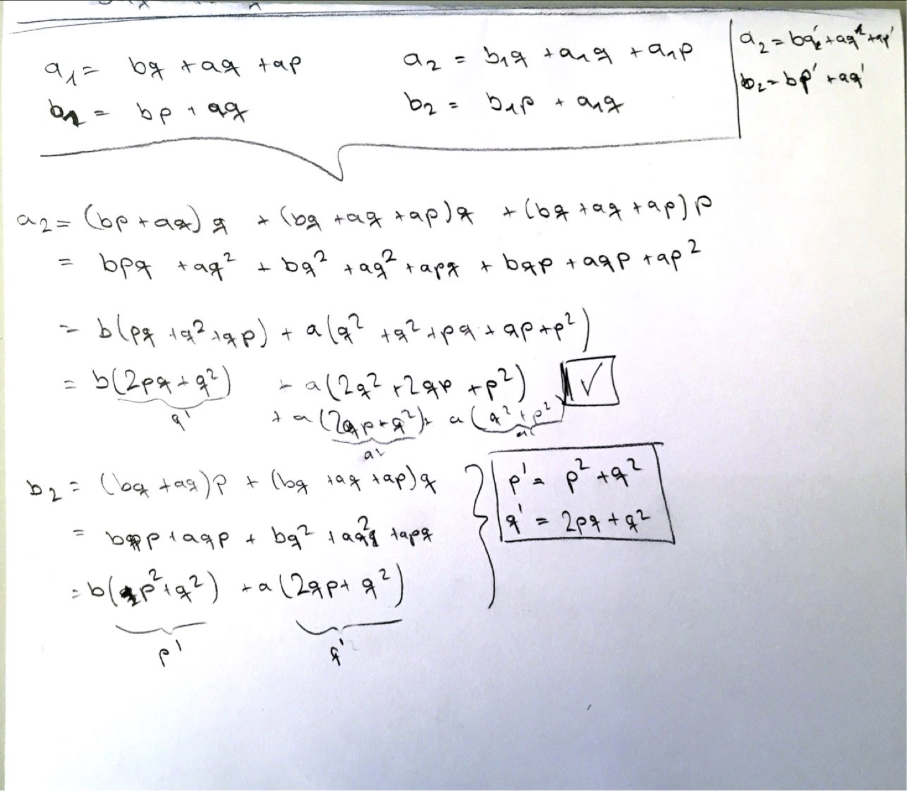

### 1.1

```
-> 10
10
```

```
-> (+ 5 3 4)
12
```

```
> (- 9 1)
8
```

```
> (/ 6 2)
3
```

```
-> (+ (* 2 4) (- 4 6))
6
```

```
-> (define a 3)
-> (define b (+ a 1))
a is 3
b is 4
```

```
-> (+ a b (* a b))
19
```

```
-> (= a b)
#f
```


```
-> (if (and (> b a) (< b (* a b)))
	b 
	a)
4
```

```
-> (cond ((= a 4) 6)
	  	 ((= b 4) (+ 6 7 a))
	  	 (else 25))
16
```

```
-> (+ 2 (if (> b a) b a))
6
```

```
-> (* (cond ((> a b) a) 
       	    ((< a b) b)
            (else -1)) 
   (+ a 1))
16
```


### 1.2


```lisp
-> (/ (+ 5 4 (- 2 (- 3 (+ 6 (/ 4 5)))))
   (* 3 (- 6 2) (- 2 7)))
-37/150
```

### 1.3

```lisp
(define (square a) (* a a))
(define (square-sum a b) (+ (square a) (square b)))
(define (largest-square-sum a b c)
  (cond ((< a b) (if (< a c) (square-sum b c) (square-sum a b)))
        (else (if (< b c) (square-sum a c) (square-sum a b)))))
```


### 1.4

Explain:

```lisp
(define (a-plus-abs-b a b) 
  ((if (> b 0) + -) a b))
```

Answer:

We choose the operator based on the predicate value of the value `b` being
greater than 0 or not. If `b` is positive the operator result is `+` otherwise
it's `-`.  So our operator is the result of the compound expression, which is
then used for adding or subtracting to the operands `a` and `b`.


### 1.5

We have a test procedure below. 

```lisp
(define (p) (p)) 
(define (test x y)
  (if (= x 0) 0 y))
```

Evaluate the expression:

```lisp
(test 0 (p))
```

What behaviour will we observe with an interpreter that uses applicative-order evaluation?
What behaviour will we observe with an interpreter that uses normal-order evaluation?

Answer:

1. If it's applicate-order evaluation it will run infinitely. Because the
procedure with name (p) will recursively apply to itself (trying to evaluate
itself). So the expression `(test 0 (p))` never exists, because the sub
expression `(p)` never returns.

2. If it's normal-order evaluation, it will return the `consequent` value of
the if special form, because the argument `x` will be substituted with `0`
and the sub expression `(= x 0)` yields true, which  results in returning the
consequent value `0`

### 1.6

It's because of the evaluation strategy. `if` is a special form, so the
consequent and alternative are not evaluated until the predicate is known.
However `new-if` is a new procedure, and because Scheme uses applicate-order
evaluation, all arguments are evaluated. What this means it, it infinitely
evaluates `sqrt-iter`, which evaluates itself recursively until its out of
memory.

### 1.7

Two example of small and large numbers that makes it fails are:

```
(sqrt 0.000016)
(sqrt 81234567890123)
```

The small number is failing because the square root of `0.000016` is 0.004` and
the tolerance of `0.001` itself is enough to skew the guess, because it has
little difference with the original value.

The large number is failing because it takes a very long time to get the right
gueest to the high number of retrievals. Why? Because substraction `0.001` from
a very large number doesn't affect the result anymore due to floating-point
numbers. (think of substracting `0.0001` from infinity, nothing changes right). 

A better `good-enough?` precade would be (procedures that are changed from the
previous implementation):

```lisp
(define (sqrt-iter guess prev-guess x)
  (if (good-enough? guess prev-guess)
      guess
      (sqrt-iter (improve guess x) guess x)))

;; we can also define 0.001 as (/ guess 1000) to represent it as a fraction of
;; the guess instead of an hardcoded value
(define (good-enough? guess prev-guess)
  (< (abs (- guess prev-guess)) 0.001))

(define (sqrt x) (sqrt-iter 1.0 0.0 x))
```

This yields better results for both small and large numbers. For small numbers
it yield better results because we are not bound to the actuall result and can
iterate more precisely. For large numbers it yield better because the number of
iterations are lower than before and we are again bound to the tolerance of
`0.001`


## 1.8

All definitions with examples can be seen follow. This is exactly the same as
with `sqrt` procedure, we only changed the `improve` procedure with the
procedure given in the book. The follow definitions also includes the guess
improvement from the following example (1.7)

```lisp
(define (cbrt-iter guess prev-guess x)
  (if (good-enough? guess prev-guess)
      guess
      (cbrt-iter (improve x guess) guess x)))

(define (improve x guess)
  (/ (+ (/ x (square guess)) (* 2 guess)) 3))

(define (good-enough? guess prev-guess)
  (< (abs (- guess prev-guess)) (/ guess 1000)))

(define (square x) (* x x))
(define (abs x)
  (cond ((< x 0) (- x))
        ((> x 0) x)
        ((= x 0) 0)))

(define (cbrt x) (cbrt-iter 1.0 0.0 x))

;; examples
(cbrt 0.001)
(cbrt 27)
(cbrt 64)
(cbrt 125)
```

## 1.9

```lisp
(define (+ a b)
  (if (= a 0) b (inc (+ (dec a) b))))
```

(I've forgot to depict the `dec` expressions)

```
(+ 4 5)
(inc (+ 3 5))
(inc (inc (+ 2 5)))
(inc (inc (inc (+ 1 5))))
(inc (inc (inc (inc (+ 0 5)))))
(inc (inc (inc (inc (5)))))
(inc (inc (inc (6))))
(inc (inc (7)))
(inc (8))
9
```

```lisp
(define (+ a b)
  (if (= a 0) b (+ (dec a) (inc b))))
```

```
(+ 4 5) 
(+ (dec 4) (inc 5)) 
(+ 3 6) 
(+ (dec 3) (inc 6)) 
(+ 2 7) 
(+ (dec 2) (inc 7)) 
(+ 1 8) 
(+ (dec 1) (inc 8)) 
(+ 0 9) 
9
```

As seen above, the first process is recursive (it defers the operation of inc).
The second process is iterative as the state is known at any point.

## 1.10

I've didn't just plugged into the interpreter, instead tried to get the idea
behind it. Checkout the Wikipedia page for Ackermann function's, it's really
beautiful: https://en.wikipedia.org/wiki/Ackermann_function

Answers are:


```lisp
(A 1 10)
```

This definition expands into `(A (0) (A (0) (A (0) ...)))` up to 10 times. The
latest expression will be `(A 1 1)` which evaluates to 2. So this means we are
multiplying the value `2` up to 10 times. So it's basically `2 ^ 10` -> `1024`


```lisp
(A 2 4)
```

This definition evaluates into `(A 1 (A 1 4))` after a couple of iterations.
Because we know that `(A 1 N)` is equal to `2 ^ N` (from the previous
procedure), this simplifies to `(A 1 16)` (because (A 1 4) is equal to `2^4` ->
16). So basically  we end up with `(A 1 16)`, which is `2 ^ 16` -> `65536`


```lisp
(A 3 3)
```

This definition evaluates into `(A 2 (A 2 (A 3 1)))` after a couple of
iterations. Which is then evaluated as `(A 2 (A 2 2))`. Evaluating `(A 2 2)`
gives us 4, so the final form is `(A 2 4)` which is the same as the previous
example. So the result is `2 ^ 16` -> `65536`


Define the following procedures as mathematical definitions:


```lisp
(define (f n) (A 0 n)) 
```
This is very easy because it always calls the expression `2*y`, so this is mathematically: `2n`


```lisp
(define (g n) (A 1 n)) 
```
This is also known (from the previous definitions), we can define it as: `2^n`


```lisp
(define (h n) (A 2 n)) 
```

We have already two solutions from the above, adding the rest we got

```
(A 2 1) -> 2
(A 2 2) -> 4
(A 2 3) -> 16
(A 2 4) ->  65536
```

Looking carefully we can see this all about the power of two. So it's basically: `2^2^2...` n times

All the definitions above are invalid of `n < 0` and `0` for the case `n = 0`

## 1.11

Recursive process

```lisp
(define (f n)
  (cond ((< n 3) n)
        (else (+ (f (- n 1))
                 (* 2 (f (- n 2)))
                 (* 3 (f (- n 3)))))))
```


For iterative process, we do the same as it's been done previously with the
Fibonnaci example. In this cases the states are:

a <- a + 2b + 3c
b <- a
c <- b

We shortcut for cases `n < 3`, for any other the iterative process (the
`f-iter` procedure) takes effect.

```lisp
(define (f n)
  (if (< n 3)
      n
      (f-iter 2 1 0 n)))

(define (f-iter a b c count)
  (if (= count 2)
      a
      (f-iter (+ a ( * 2 b) (* 3 c)) a b (- count 1))))
```

## 1.12

I understand that by computing the element it means to get an element from a
given row and column. The solution below assumes the row and column index
starts from `0` (convention from: https://en.wikipedia.org/wiki/Pascal's_triangle)

The degenerate cases are:

* We assume every negative column index to be `0` (so each `0` index colum can
  produce `1`)
* We assume every column index greater than row index to be `0` (so each `row
  == col` case produces a `1`)
* We assume that column 0 is always 1. This is our state value which carried
  with each recursive process


```lisp
(define (pascal row col)
  (cond ((< row col) 0)
        ((< col 0) 0)
        ((= col 0) 1)
        (else (+
               (pascal (- row 1) (- col 1))
               (pascal (- row 1) col)))))
```

## 1.13

1. Fib(n) is the closest integer to `q^n /  sqrt 5`. So if we pass `1` and `2` for
`n`, and divide each other we get `q`:

```
Fib(2)/Fib(1) = q
```

So this means basically

```
Fib(n + 1)/Fib(n) = q
```

As seen below, with every high `n` value it satisfies the equation

```
(/ (fib 8) (fib 7))   -> 1.5384
(/ (fib 10) (fib 9))  -> 1.617647
(/ (fib 11) (fib 10)) -> 1.618
```


2. I've skipped the induction proof as it should be straight forward to assume
   for certain cases of n (`0`, `1`, `2`, etc..) and do the proof.


## 1.14

Below is an ASCII drawing of `(count-change 11 5)`. This is taken from another
[place](https://github.com/martinblech/sicp/blob/master/01/1.14.scm) as I did
draw it on a paper. As seen there are four possibilities:

```
10 + 1
5 + 5 + 1
5 + 1 + 1 + 1 + 1 + 1 + 1
1 + 1 + 1 + 1 + 1 + 1 + 1 + 1 + 1 + 1 + 1
```

Diagram:

```
; cc 11 5
;    |    \
; cc 11 4  cc -39 5
;    |    \
; cc 11 3  cc -14 4
;    |    \----------------------------------------\
; cc 11 2                                           cc 1 3
;    |    \------------------------\                   |   \
; cc 11 1                           cc 6 2          cc 0 3  cc -9 3
;    |    \                            |   \---------------\
; cc 11 0  cc 10 1                  cc 6 1                  cc 1 2
;             |    \                   |   \                   |   \
;          cc 10 0  cc 9 1          cc 6 0  cc 5 1          cc 0 2  cc -4 2
;                      |   \                   |   \
;                   cc 9 0  cc 8 1          cc 5 0  cc 4 1
;                              |   \                   |   \
;                           cc 8 0  cc 7 1          cc 4 0  cc 3 1
;                                      |   \                   |   \
;                                   cc 7 0  cc 6 1          cc 3 0  cc 2 1
;                                              |   \                   |   \
;                                           cc 6 0  cc 5 1          cc 2 0  cc 1 1
;                                                      |   \                   |   \
;                                                   cc 5 0  cc 4 1          cc 1 0  cc 0 1
;                                                              |   \
;                                                           cc 4 0  cc 3 1
;                                                                      |   \
;                                                                   cc 3 0  cc 2 1
;                                                                              |   \
;                                                                           cc 2 0  cc 1 1
;                                                                                      |   \
;                                                                                   cc 1 0  cc 0 1
```

The question is asking for:

1. Order of growth of the space (Space complexity): The order of growth is
   increasing linearly because the depth of the tree is increasing linearly.
   Basically we only keep track of the trail nodes. So answer is `Θ(n)`

2. Number of steps used as the amount to be changed increases (Time
   complexity): This requires a more formal mathematic proof. But looking
   carefully and we can see from the diagram that there is a new leaf for each new
   first kind of coin.  So basically because we have `5` kinds of coins, it'll be
   `Θ(n^5)` I've found a better explanation here too:
   http://www.billthelizard.com/2009/12/sicp-exercise-114-counting-change.html

## 1.15

a.) `p` will be applied 5 times

b.) First of all because the procedure is a recursive process, the interpreter
only keeps a fixed result to be applied to `p`. It also requires a fixed number
of steps. The order of growth (space complexity) is increasing logarithmic
(just like a binary-tree search), as we divide it each time until we stop when
the absolute difference of a is smaller than `0.1` So it is `theta(a)`. The
number of steps (time complexity) is also the same (logarithmic increase)

## 1.16

I had the solution like below (without using `a` at all)

```lisp
(define (square n) (* n n))
         
(define (expt b n)
  (if (even? n)
      (fast-expt-iter b n)
      (* b (fast-expt-iter b (- n 1)))))

(define (fast-expt-iter b counter)
  (if (= counter 1)
      b
      (fast-expt-iter (square b) (/ counter 2))))
```

However I believe the solution above is not iterative process, because for a
non even (odd) case it stores the `b` before it continue. I'm not quite sure
here, so I would be happy if anyone reading this can clarify it.

Another solution would be using `cond` and doing the converting of `odd ->
even` via the `a` parameter. This is much more elegant of course and truly
iterative.

```lisp

(define (square n) (* n n))
         
(define (expt b n) (fast-expt-iter 1 b n))

(define (fast-expt-iter a b counter)
  (cond ((= counter 0) a)
        ((even? counter) (fast-expt-iter a (square b) (/ counter 2)))
        (else (fast-expt-iter (* a b) b (- counter 1)))))
```


## 1.17

Below is a recursive process of using `double` and `halve` to implement
multiplication in logarithmic number of steps.

```lisp
(define (double n) ( + n n)) ;; I assume * is not available
(define (halve n) (/ n 2))

(define (* a b)
  (cond ((= b 1) a)
        ((even? b) (double (* a (halve b))))
        (else (+ a (double (* a (halve (- b 1))))))))
```

Just discovered that the else branch can be simplified:

```lisp
(define (* a b)
  (cond ((= b 1) a)
        ((even? b) (double (* a (halve b))))
        (else (+ a (* a (- b 1))))))
```

## 1.18

A iterative process using `double`, `halve` which uses logarithmic number of
steps. So doubling the input size will increase the computing step only by one.
The below procedures are similar to the previous `fast-expt` procedures which
uses the `invariant quantity` described in the book.

```lisp
(define (double n) ( + n n)) ;; I assume * is not available
(define (halve n) (/ n 2))

(define (* a b) (mul-iter 0 a b))

(define (mul-iter a x y)
  (cond (( = y 0) a)
        ((even? y) (mul-iter a (double x) (halve y)))
        (else (mul-iter (+ a x) x (- y 1)))))
```
  

## 1.19

The substitution is below:



So this means we have the following for `p'` and `q'`:

```
p' = p^2 + q^2
q' = 2pq + q^2
```

So the final solution would be:

```lisp
(define (fib n)
  (fib-iter 1 0 0 1 n))

(define (fib-iter a b p q count)
  (cond ((= count 0) b)
        ((even? count)
         (fib-iter a
                   b
                   (+ (* p p) (* q q))
                   (+ ( * 2 p q) (* q q))
                   (/ count 2)))
        (else (fib-iter (+ (* b q) (* a q) (* a p))
                        (+ (* b p) (* a q))
                        p
                        q
                        (- count 1)))))
```


## 1.20

The procedure is like below:

```lisp
(define (gcd a b)
  (if (= b 0)
      a
      (gcd b (remainder a b))))
```

Now using first `normal-order evaluation`

```
(gcd 206 40)
  (if (= 40 0)
      a
	  (gcd 40 (remainder 206 40))

(gcd 40 (remainder 206 40)
  (if (= (remainder 206 40) 0)) ;; 6
      40
	  (gcd (remainder 206 40) (remainder 40 (remainder 206 40))))


(gcd (remainder 206 40) (remainder 40 (remainder 206 40))
  (if (= (remainder 40 (remainder 206 40)) 0) ;; 4
      (remainder 206 40)
      (gcd (remainder 40 (remainder 206 40)) (remainder (remainder 206 40) (remainder 40 (remainder 206 40))))))

      
(gcd (remainder 40 (remainder 206 40)) (remainder (remainder 206 40) (remainder 40 (remainder 206 40)))
  (if (= (remainder (remainder 206 40) (remainder 40 (remainder 206 40))) 0) ;; 2
      (remainder 40 (remainder 206 40))
      (gcd (remainder (remainder 206 40) (remainder 40 (remainder 206 40))) (remainder (remainder 40 (remainder 206 40)) (remainder (remainder 206 40) (remainder 40 (remainder 206 40)))))))


(gcd (remainder (remainder 206 40) (remainder 40 (remainder 206 40))) (remainder (remainder 40 (remainder 206 40)) (remainder (remainder 206 40) (remainder 40 (remainder 206 40))))
  (if (= (remainder (remainder 40 (remainder 206 40)) (remainder (remainder 206 40) (remainder 40 (remainder 206 40)))) 0) ;; 0
      (remainder (remainder 206 40) (remainder 40 (remainder 206 40)))
      (gcd ...)))
```

So now for every `if` branch we evaluate the `predicate` expression first and
then decide if whether to evaluate the `consequent` or the `alternative`
expression. This means every if `predicate` is evaluated until it's equal to
`0` and we exit with evaluating the `consequent`. Now counting all `if`
predicate expressions until it's hit `0`:

```
1 -> (if (= (remainder 206 40) 0))
2 -> (if (= (remainder 40 (remainder 206 40)) 0)
4 -> (if (= (remainder (remainder 206 40) (remainder 40 (remainder 206 40))) 0)
7 -> (if (= (remainder (remainder 40 (remainder 206 40)) (remainder (remainder 206 40) (remainder 40 (remainder 206 40)))) 0)
```

So from the `if` forms we got total: `14`

After that what left is the consequent expression which is:

```lisp
(remainder (remainder 206 40) (remainder 40 (remainder 206 40)))
```

From here we have total: `4`

So the final answer for normal-value evaluation is: `18`


